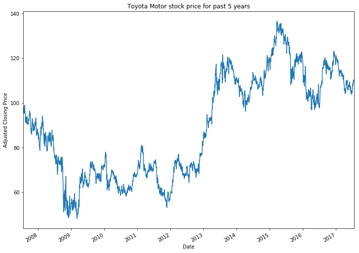
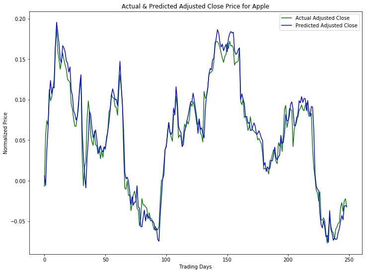
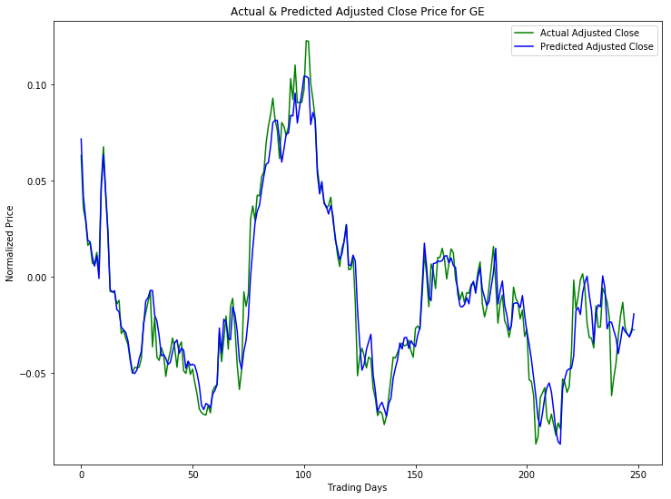
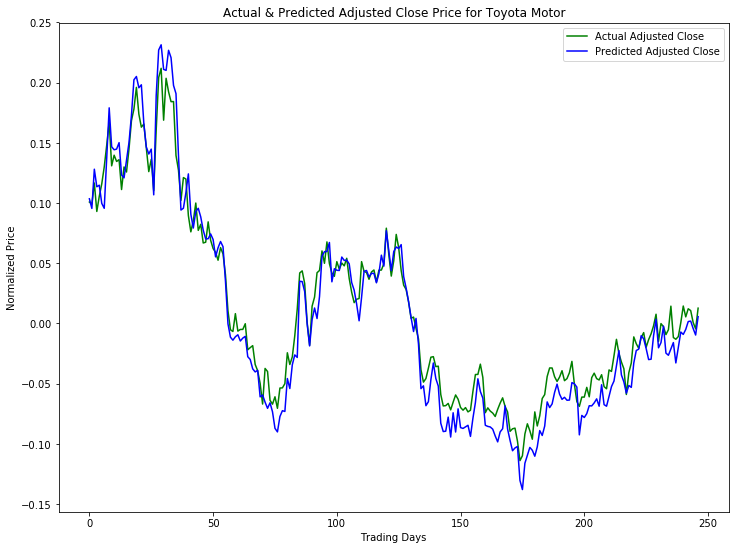
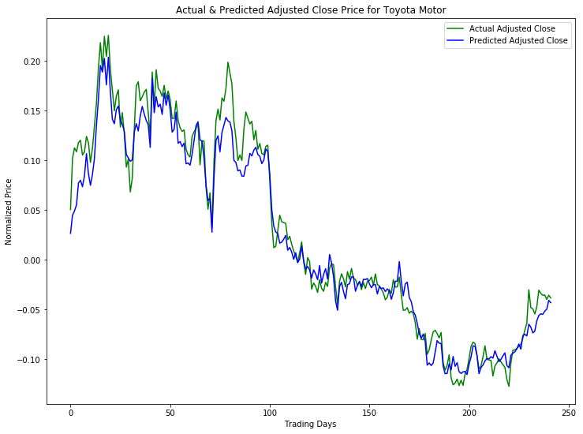
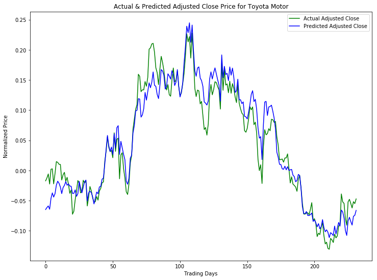
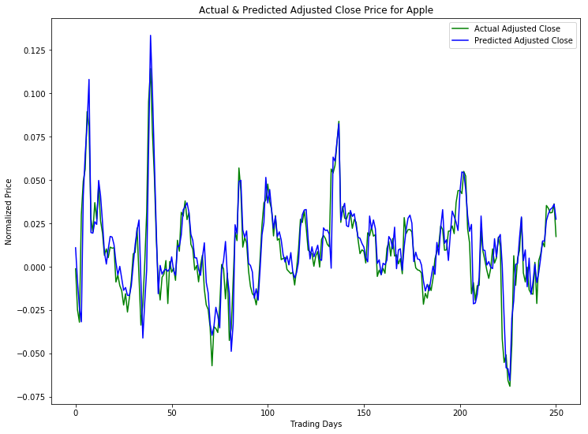
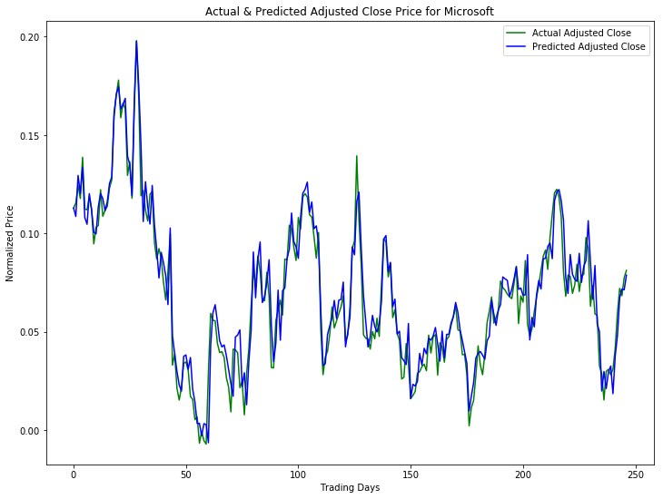

<style>
    td, th {
        border: 1px solid #dfdfdf;
        padding: 2px;
    }
</style>

# Machine Learning Engineer Nanodegree
## Capstone Project
Yuichi Hagio
Aug 05, 2017

## I. Definition

Stock Price Predictor

### Project Overview

Machine learning can be great at predicting the future from the historical data. 
A machine-learning algorithm can be more accurate on the prediction 
than conventional trading strategies based on rules set by humans.

Investment firms have adopted machine learning in recent years rapidly, 
even some firms have started replacing humans with A.I. to make investment decisions.

In this project, simply I experimented to use Deep Learning to predict stock prices.

### Problem Statement

There is no easy way to predict stock prices accurately 
and no method is perfect since there are many factors
that can affect the stock prices (i.e. people's emotion, natural disasters, etc), 
but I believe that I can predict whether the closing price goes up or down by
applying machine learning techniques and algorithm from the historical data set for this project. 

<div style="page-break-after: always;"></div>

### Metrics

To determine how accurate the prediction is, we analyze the difference between 
the predicted and the actual adjusted close price. Smaller the difference indicates better 
accuracy. 

I chose both Mean Squared Error (MSE) and Root Mean Squared Error (RMSE) 
as a metric to determine the accuracy of the prediction. 
It is a commonly used general purpose quality estimator.

Also, by visualizing the predicted price and the actual price with a plot or a graph,
it can tell how close the prediction is clearly.


**Why I use MSE/RMSE for the metric?**

There are many metrics for accuracy like R2, MAE, etc.

I chose to use MSE/RMSE because they explicitly show the deviation of the prediction
for continuous variables from the actual dataset.
So, they fit in this project to measure the accuracy.


It measures the average magnitude of the error and ranges from 0 to infinity.
The errors are squared and then they are averaged,
MSE/RMSE gives a relatively high weight to large errors, and the errors in stock price prediction
can be critical, so it is appropriate metric to penalize the large errors.

<div style="page-break-after: always;"></div>


## II. Analysis

### Data Exploration

There are several data sources for the historical stock price data.
I can use yahoo finance data set (`.csv` format) for this project.

Data set is daily historical prices for 10 years (Jul 24, 2007 - Jul 24, 2017),
which is **2518** dataset for each stock (2518 days of trading).

90% of the data set were used for training.<br />
10% of the data set were used for testing.

I downloaded the CSV file for each (GE, S&P 500, Microsoft, Apple, Toyota) from Yahoo Finance.

- GE: https://finance.yahoo.com/quote/GE/history?p=GE
- Microsoft: https://finance.yahoo.com/quote/MSFT/history?p=MSFT
- Apple: https://finance.yahoo.com/quote/AAPL/history?p=AAPL
- Toyota: https://finance.yahoo.com/quote/TM/history?p=TM
- S&P 500: https://finance.yahoo.com/quote/%5EGSPC/history?p=%5EGSPC

**_Example data from csv_**

The data includes following properties:

| Date       | Open       | High       | Low	    | Close      | Adj Close | Volume  |
| ---------- | ---------- | ---------- | ---------- | ---------- | --------- | ------- |
| 2007-07-24 | 123.779999 | 123.779999 | 122.309998	| 122.489998 | 98.390572 | 418000  |
| 2007-07-25 | 123.389999 | 123.410004 | 121.500000	| 122.290001 | 98.229897 | 557900  |
| 2007-07-26 | 122.320000 | 122.349998 | 117.050003	| 119.199997 | 95.747864 | 1258500 |

All the dataset has following columns: <br />
**Date**: Year-Month-Day <br />
**Open**: The Price of the stock at the opening of the trading day ($US) <br />
**High**: The highest price of the stock during the trading day ($US) <br />
**Low**: The lowest price of the stock during the trading day ($US) <br />
**Close**: The Price of the stock at the closing of the trading day ($US) <br />
**Adj Close**: The price of the stock at the closing of the trading day adjusted with the dividends ($US) <br />
**Volume**: The amount of traded stocks on the day ($US)

The dataset is straight forward and there is no missing value in each column.

<div style="page-break-after: always;"></div>


### Exploratory Visualization

**Toyota Motor data**

The following image is the plot of the dataset from Toyota Motor for
Adjusted Close Price for 10 years trading period.
X-axis is the trading days and Y-axis is the adjusted price.
I used the simple line chart,
so that it is easily understandable how the stock price is moving each day.




<div style="page-break-after: always;"></div>


### Algorithms and Techniques

From the data set of yahoo finance. Predict the closing price of a target day based on the 
historical data up to the previous day of the target day.

I decided to use a kind of Recurrent Neural Network (RNN), called Long Short Term Memory (LSTM)
from Keras library for the solution model. RNN is a deep learning algorithm that has a "memory"
to remember / store the information about what has been calculated previously.

LSTM networks have memory blocks that are connected through layers,
and it can choose what it remembers and can decide to forget,
so it can adjust how much of memory it should pass to next layer.

Since I use the time series of data of stock prices and try to predict the price,
LSTM looks good fits for this project.


<div style="page-break-after: always;"></div>


### Benchmark

As a baseline benchmark model, I used **Linear Regression** model.

**_Why I chose Linear Regression as a baseline benchmark model?_**

Linear Regression is simple and fairly rigid approximeter to be used as a baseline algorithm.
Since I do not want to set the baseline model to be complicated, slow, or 
requiring a sort of data transformation to implement.
Linear Regression is simple, fast, and is not required to transform the dataset. So,
it satisfies my need for this.

As the solution model, I chose **LSTM** model as the solution benchmark model
as explained in  **Algorithms and Techniques** section (above).

I can compare the actual MSE and RMSE score how effectively LSTM model predicts
compared to simple Linear Regression model.
Also, by visualizing the actual price and the prediction, it can be compared visually as well.


<div style="page-break-after: always;"></div>


## III. Methodology

### Data Preprocessing

Since it simply tries to predicts the **Adjusted Close** Price from the past data, I believe
there is no need for feature engineering. Also there are no missing values or abnormality in the dataset.
For this project, I use **dates** and **adjusted close price** to keep it simple.

For Linear Regression, I use Pandas read CSV file into DataFrame.
I use dates and adjusted close prices, but the dates are strings and not numerical,
so I simply put the trading days as integers, so total trading days are equal to total number of dataset.

And then, I used `train_test_split` from `sklearn.cross_validation` to split the dataset
into training and testing sets. That's it for data preparation for the baseline Linear Regression model.

For LSTM model,
I normalized the Adjusted Closing Prices to improve the convergence.
I used LSTM from Keras library with Tensorflow backend.

<div style="page-break-after: always;"></div>


I created helper functions for loading datasets when using LSTM model as explained below:

- `load_adj_close`: load a CSV file and return only 'Adj Close' column
- `load_data_split_train_test`: Load and split datasets into training and testing sets
- `normalize_window`: Normalize datasets to improve the convergence

```py
# Load only 'Adj Close' column from CSV
def load_adj_close(filePath):
    columns = defaultdict(list) # each value in each column is appended to a list

    with open(filePath) as f:
        reader = csv.DictReader(f)    # read rows into a dictionary format
        for row in reader:            # read a row as {column1: value1, column2: value2,...}
            for (k,v) in row.items(): # go over each column name and value 
                columns[k].append(v)  # append the value into the appropriate list based on column name k

    return columns['Adj Close']

# Loading datasets and turn them into training and testing sets
def load_data_split_train_test(data, seq_len, normalize_window):
    sequence_length = seq_len + 1
    result = []
    for index in range(len(data) - sequence_length):
        result.append(data[index: index + sequence_length])
    
    if normalize_window:
        result = normalize_windows(result)

    result = np.array(result)

    # Select 10% of the data for testing and 90% for training.
    # Select the last value of each example to be the target.
    # The other values are the sequence of inputs.
    # Shuffle the data in order to train in random order.
    row = round(0.9 * result.shape[0])
    train = result[:int(row), :]
    np.random.shuffle(train)
    x_train = train[:, :-1]
    y_train = train[:, -1]
    x_test = result[int(row):, :-1]
    y_test = result[int(row):, -1]

    # Reshape the inputs from 1 dimenstion to 3 dimension
    x_train = np.reshape(x_train, (x_train.shape[0], x_train.shape[1], 1))
    x_test = np.reshape(x_test, (x_test.shape[0], x_test.shape[1], 1))  

    return [x_train, y_train, x_test, y_test]

# Normalize function
# Normalize each value to reflect the percentage changes from starting point
def normalize_windows(window_data):
    normalised_data = []
    for window in window_data:
        normalised_window = [((float(p) / float(window[0])) - 1) for p in window]
        normalised_data.append(normalised_window)
    return normalised_data
```

<div style="page-break-after: always;"></div>


### Implementation

**Baseline - Linear Regression model**

Linear Regression implementation is simple.
Split the datasets into training (90%) and testing (10%).
And then, build the model and return the results (MSE and RMSE).
```py
# Load data (Toyota Motor) and split it into training and testing
data = pd.read_csv(csv_file)
dates = pd.DataFrame(np.arange(len(data)))
adj_closes = data['Adj Close']
X_train, X_test, y_train, y_test = train_test_split(dates, adj_closes, test_size = 0.1, random_state = 0)

# Show the results of the split
print "Training set has {} samples.".format(X_train.shape[0])
print "Testing set has {} samples.".format(X_test.shape[0])

# Build Linear Regression model
regr = linear_model.LinearRegression()
regr.fit(X_train[:int(len(data)*0.9)], y_train[:int(len(data)*0.9)])

# Result (Accuracy score MSE and RMSE)
TM_MSE = np.mean((regr.predict(X_test) - y_test) ** 2)
TM_RMSE = sqrt(TM_MSE)
```


#### Linear Regression plot


#### Linear Regression results (MSE/RMSE)
|Company/Index    |MSE/RMSE         |
|-----------------|-----------------|
|Toyota (MSE)     | 224.08264758    |
|Toyota (RMSE)    | 14.9693903543   |
|Apple (MSE)      | 139.563948246   |
|Apple (RMSE)     | 14.9693903543   |
|GE (MSE)         | 21.4913114234   |
|GE (RMSE)        | 14.9693903543   |
|Microsoft (MSE)  | 37.4523711689   |
|Microsoft (RMSE) | 14.9693903543   |
|S&P 500 (MSE)    | 37539.2002769   |
|S&P 500 (RMSE)   | 14.9693903543   |

<div style="page-break-after: always;"></div>

**The solution - Initial LSTM model**

First implementation of LSTM model follows.

```py
# LSTM Model parameters, I chose
batch_size = 1            # Batch size
nb_epoch = 1              # Epoch
seq_len = 30              # 30 sequence data
loss='mean_squared_error' # Since the metric is MSE/RMSE
optimizer = 'rmsprop'     # Recommended optimizer for RNN
activation = 'linear'     # Linear activation
input_dim = 1             # Input dimension
output_dim = 30           # Output dimension

# Get Adjusted Close price and split the data into training and testing sets with helper functions
adj_closes = load_adj_close(csv_file)
X_train_, y_train_, X_test_, y_test_ = load_data_split_train_test(adj_closes, seq_len, True)

# Initialize Sequential, which is a linear stack layer
model = Sequential()

# Add a LSTM layer with the input dimension is 1 and the output dimension is 50
# The output is not fed into next layer
model.add(LSTM(
    input_dim=input_dim,
    output_dim=output_dim,
    return_sequences=False))

# Add Dense layer to aggregate the data from the prediction vector into a single value
model.add(Dense(
    output_dim=1))

# Add Linear Activation function
model.add(Activation(activation))

# Compile the model with MSE loss and RMSprop optimiser, since this is recommended for RNN
start = time.time()
model.compile(loss=loss, optimizer=optimizer)

# Train the model
model.fit(
    X_train_,
    y_train_,
    batch_size=batch_size,
    nb_epoch=nb_epoch,
    validation_split=0.05)

# Predict
testPredict = model.predict(X_test_, batch_size=batch_size)
score = model.evaluate(X_test_, y_test_, batch_size=batch_size, verbose=0)

# Result (MSE adn RMSE)
TM_MSE = score
TM_RMSE = math.sqrt(score)
```

#### Iitial LSTM plot







#### Iitial LSTM model results (MSE/RMSE)
|Company/Index    |MSE/RMSE         |
|-----------------|-----------------|
|Toyota (MSE)     |0.000143752868767|
|Toyota (RMSE)    |0.0119896984435  |
|Apple (MSE)      |0.000206062711005|
|Apple (RMSE)     |0.0143548845695  |
|GE (MSE)         |0.000102261837848|
|GE (RMSE)        |0.010112459535   |
|Microsoft (MSE)  |0.000104691520582|
|Microsoft (RMSE) |0.0102318874398  |
|S&P 500 (MSE)    |6.13824635252e-05|
|S&P 500 (RMSE)   |0.00783469613484 |

<div style="page-break-after: always;"></div>

#### Comparison of results of Basic LSTM results and Linear Regression

LSTM&nbsp;&nbsp;&nbsp;&nbsp;&nbsp;&nbsp;&nbsp;&nbsp;&nbsp;&nbsp;&nbsp;&nbsp;&nbsp;&nbsp;&nbsp;&nbsp;&nbsp;&nbsp;&nbsp;&nbsp;&nbsp;&nbsp;&nbsp;&nbsp;&nbsp;&nbsp;&nbsp;&nbsp;&nbsp;&nbsp;&nbsp;&nbsp;&nbsp;&nbsp;&nbsp;&nbsp;&nbsp;&nbsp;&nbsp;&nbsp;&nbsp;&nbsp;&nbsp;&nbsp;&nbsp;&nbsp;&nbsp;&nbsp;&nbsp;&nbsp;&nbsp;&nbsp;&nbsp;&nbsp;&nbsp;&nbsp;&nbsp;&nbsp;&nbsp;&nbsp;&nbsp;&nbsp;&nbsp;&nbsp;&nbsp;&nbsp;&nbsp;&nbsp;&nbsp;&nbsp;Linear Regression

|Company/Index    |MSE/RMSE         |Company/Index    |MSE/RMSE         |
|-----------------|-----------------|-----------------|-----------------|
|Toyota (MSE)     |0.000143752868767|Toyota (MSE)     | 224.08264758    |
|Toyota (RMSE)    |0.0119896984435  |Toyota (RMSE)    | 14.9693903543   |
|Apple (MSE)      |0.000206062711005|Apple (MSE)      | 139.563948246   |
|Apple (RMSE)     |0.0143548845695  |Apple (RMSE)     | 14.9693903543   |
|GE (MSE)         |0.000102261837848|GE (MSE)         | 21.4913114234   |
|GE (RMSE)        |0.010112459535   |GE (RMSE)        | 14.9693903543   |
|Microsoft (MSE)  |0.000104691520582|Microsoft (MSE)  | 37.4523711689   |
|Microsoft (RMSE) |0.0102318874398  |Microsoft (RMSE) | 14.9693903543   |
|S&P 500 (MSE)    |6.13824635252e-05|S&P 500 (MSE)    | 37539.2002769   |
|S&P 500 (RMSE)   |0.00783469613484 |S&P 500 (RMSE)   | 14.9693903543   |

Obviously LSTM model's prediction is more accurate significantly as observed
from the MSE / RMSE results for each dataset.

For example, comparing Toyota dataset, LSTM model's RMSE is 0.0119896984435 and Linear Regression's is
14.9693903543. LSTM model predicts about 1248% more accurate (RMSE of Linear Regression divided by RMSE of LSTM).

<div style="page-break-after: always;"></div>


### Refinement

Since I do not know what parameters to tune up or how many layers to add or drop in order to
lower the MSE / RMSE, I need to simply play around them to find the best solution.

So, I experimented by playing with parameters and adding and dropping layers to see 
which one produces better results (Lower MSE / RMSE score).

I experimented with just Toyota datasets since it is time consuming and
does not really make sense to apply the same algorithm and
the technique to all the datasets (Apple, GE, Microsoft, S&P 500) to see
the effectiveness. One dataset is enough. 

There are total of 7 experiments.

<div style="page-break-after: always;"></div>

**Experiment-1**

```py
# Change params and variables
batch_size = 1            # Batch size, no change
nb_epoch = 10             # Epoch, initially 1
seq_len = 50              # Number of Sequence data, Initially 30
loss='mean_squared_error' # Since the metric is MSE/RMSE, no change
optimizer = 'rmsprop'     # Recommended optimizer for RNN, no change
activation = 'linear'     # Linear activation, no change
input_dim = 1             # Input dimension, no change
output_dim = 30           # Output dimension, initially 50

# Build Model (No change)
model = Sequential()

model.add(LSTM(
    input_dim=input_dim,
    output_dim=output_dim,
    return_sequences=False))

model.add(Dense(output_dim=1))
model.add(Activation(activation))
```


<div style="page-break-after: always;"></div>

**Experiment-2**

```py
# Change params and variables
batch_size = 1            # Batch size, no change
nb_epoch = 5              # Epoch, initially 1
seq_len = 50              # Number of Sequence data, Initially 30
loss='mean_squared_error' # Since the metric is MSE/RMSE, no change
optimizer = 'rmsprop'     # Recommended optimizer for RNN, no change
activation = 'linear'     # Linear activation, no change
input_dim = 1             # Input dimension, no change
output_dim = 50           # Output dimension, no change

# Build Model
# Added another LSTM layer with 20% dropout when feeding to next layer
# Second LSTm layer takes 100 inputs
model = Sequential()

model.add(LSTM(
    input_dim=input_dim,
    output_dim=output_dim,
    return_sequences=True))
model.add(Dropout(0.2))

model.add(LSTM(
    100,
    return_sequences=False))
model.add(Dropout(0.2))

model.add(Dense(output_dim=1))
model.add(Activation(activation))

```



<div style="page-break-after: always;"></div>

**Experiment-3**

```py
# Change params and variables
batch_size = 128          # Batch size, initially 1
nb_epoch = 5              # Epoch, initially 1
seq_len = 100             # Number of Sequence data, Initially 30
loss='mean_squared_error' # Since the metric is MSE/RMSE, no change
optimizer = 'rmsprop'     # Recommended optimizer for RNN, no change
activation = 'linear'     # Linear activation, no change
input_dim = 1             # Input dimension, no change
output_dim = 50           # Output dimension, no change

# Build Model
# Added another LSTM layer with 20% dropout when feeding to next layer
# Second LSTm layer takes 200 inputs
model = Sequential()

model.add(LSTM(
    input_dim=input_dim,
    output_dim=output_dim,
    return_sequences=True))
model.add(Dropout(0.2))

model.add(LSTM(
    200,
    return_sequences=False))
model.add(Dropout(0.2))

model.add(Dense(output_dim=1))
model.add(Activation(activation))
```


<div style="page-break-after: always;"></div>

**Experiment-4**

```py
# Change params and variables
batch_size = 128          # Batch size, no change
nb_epoch = 5              # Epoch, initially 1
seq_len = 100             # Number of Sequence data, Initially 30
loss='mean_squared_error' # Since the metric is MSE/RMSE, no change
optimizer = 'rmsprop'     # Recommended optimizer for RNN, no change
activation = 'linear'     # Linear activation, no change
input_dim = 1             # Input dimension, no change
output_dim = 50           # Output dimension, no change

# Build Model (no change)
model = Sequential()

model.add(LSTM(
    input_dim=input_dim,
    output_dim=output_dim,
    return_sequences=False))

model.add(Dense(output_dim=1))
model.add(Activation(activation))
```



<div style="page-break-after: always;"></div>

**Experiment-5**

```py
# Change params and variables
batch_size = 512          # Batch size, initially 1
nb_epoch = 5              # Epoch, initially 1
seq_len = 200             # Number of Sequence data, Initially 30
loss='mean_squared_error' # Since the metric is MSE/RMSE, no change
optimizer = 'rmsprop'     # Recommended optimizer for RNN, no change
activation = 'linear'     # Linear activation, no change
input_dim = 1             # Input dimension, no change
output_dim = 50           # Output dimension, no change

# Build Model (no change)
model = Sequential()

model.add(LSTM(
    input_dim=input_dim,
    output_dim=output_dim,
    return_sequences=False))

model.add(Dense(output_dim=1))
model.add(Activation(activation))
```



<div style="page-break-after: always;"></div>

**Experiment-6**

```py
# Change params and variables
batch_size = 1            # Batch size, no change
nb_epoch = 10             # Epoch, initially 1
seq_len = 50              # Number of Sequence data, Initially 30
loss='mean_squared_error' # Since the metric is MSE/RMSE, no change
optimizer = 'rmsprop'     # Recommended optimizer for RNN, no change
activation = 'linear'     # Linear activation, no change
input_dim = 1             # Input dimension, no change
output_dim = 50           # Output dimension, no change

# Build Model (no change)
model = Sequential()

model.add(LSTM(
    input_dim=input_dim,
    output_dim=output_dim,
    return_sequences=False))

model.add(Dense(output_dim=1))
model.add(Activation(activation))
```


<div style="page-break-after: always;"></div>

**Experiment-7**

```py
# Change params and variables
batch_size = 1            # Batch size, no change
nb_epoch = 5              # Epoch, initially 1
seq_len = 10              # Number of Sequence data, Initially 30
loss='mean_squared_error' # Since the metric is MSE/RMSE, no change
optimizer = 'rmsprop'     # Recommended optimizer for RNN, no change
activation = 'linear'     # Linear activation, no change
input_dim = 1             # Input dimension, no change
output_dim = 50           # Output dimension, no change
```


<div style="page-break-after: always;"></div>

**Experiment results comparison**

| Time         | MSE              | RMSE            | Total computing time  |
|--------------|------------------|-----------------|-----------------------|
| Initial LSTM |0.000143752868767 |0.0119896984435  |251  seconds (00:04:11)|
| Experiment 1 |0.000203450606716 |0.0142636112789  |3994 seconds (01:06:34)|
| Experiment 2 |0.000273111962431 |0.0165260994318  |3770 seconds (01:02:50)|
| Experiment 3 |0.00143158305528  |0.0378362664025  |144  seconds (00:02:24)|
| Experiment 4 |0.00035159466805  |0.018750857795   |39   seconds (00:00:39)|
| Experiment 5 |0.000587560993154 |0.0242396574471  |42   seconds (00:00:42)|
| Experiment 6 |0.000118690346404 |0.0108945099203  |3796 seconds (01:03:16)|
| Experiment 7 |9.6412006261e-05  |0.00981896156734 |438  seconds (00:07:18)|

The experiment 6's RMSE is about 10% lower than the initial LSTM model's RMSE.
I believe this is great improvement.

From this experiment, I concluded that the experiment 6 would be my final model since it has the lowest MSE/RMSE score.
Even though it is time consuming, the time cost is not a significant drawback of this project.

As increasing the number of epoch, it will take more time to compute, but it can vary depending on the machine and also
the language used (Python 2.7 for this project). Also, from this experiment, it seems adding more layers is not really 
effective for improvement. So keeping the simple model and with small batch size seems the key for improvement.

I can apply this algorithm to other datasets as well.

<div style="page-break-after: always;"></div>

## IV. Results

### Model Evaluation and Validation

After the refinement (experimenting with parameters as described in the previous section),
the final model predicts with higher accuracy than both the initial LSTM model and the linear regression model.

Here is the final LSTM model
```py
# Tuned params and variables
batch_size = 1
nb_epoch = 10 # Initially 1
seq_len = 50 # Initially 30
input_dim=1
output_dim=50
loss='mean_squared_error'
optimizer = 'rmsprop'
activation = 'linear'

# Load datasets (No change from initial one)
csv_file = './data/TM.csv'
dfTM = pd.read_csv(csv_file, index_col='Date',parse_dates=True)

# Get Adjusted Close price and split the data (No change from initial one)
adj_closes = load_adj_close(csv_file)
X_train_, y_train_, X_test_, y_test_ = load_data_split_train_test(adj_closes, seq_len, True)

# Build Model (No change from initial one)
model = Sequential()

model.add(LSTM(
    input_dim=input_dim,
    output_dim=output_dim,
    return_sequences=False))

model.add(Dense(output_dim=1))
model.add(Activation(activation))

start = time.time()
model.compile(loss=loss, optimizer=optimizer)
print 'compilation time : ', time.time() - start

#Train the model (No change from initial one)
model.fit(
    X_train_,
    y_train_,
    batch_size=batch_size,
    nb_epoch=nb_epoch,
    validation_split=0.05)

testPredict = model.predict(X_test_, batch_size=batch_size)
score = model.evaluate(X_test_, y_test_, batch_size=batch_size, verbose=0)

TM_MSE = score
TM_RMSE = math.sqrt(score)
print 'Mean squared error (MSE)', TM_MSE
print 'Root Mean squared error (RMSE)', TM_RMSE
```

<div style="page-break-after: always;"></div>

#### Final LSTM model results

|Company/Index    |MSE/RMSE         |
|-----------------|-----------------|
|Toyota (MSE)     |0.000131006485125|
|Toyota (RMSE)    |0.0114458064428  |
|Apple (MSE)      |0.000140182430504|
|Apple (RMSE)     |0.0118398661523  |
|GE (MSE)         |7.87504528992e-05|
|GE (RMSE)        |0.00887414519259 |
|Microsoft (MSE)  |9.82947370459e-05|
|Microsoft (RMSE) |0.00991437022941 |
|S&P 500 (MSE)    |5.23874316281e-05|
|S&P 500 (RMSE)   |0.00723791624904 |


#### Comparison between initial and final LSTM models results

Initial LSTM&nbsp;&nbsp;&nbsp;&nbsp;&nbsp;&nbsp;&nbsp;&nbsp;&nbsp;&nbsp;&nbsp;&nbsp;&nbsp;&nbsp;&nbsp;&nbsp;&nbsp;&nbsp;&nbsp;&nbsp;&nbsp;&nbsp;&nbsp;&nbsp;&nbsp;&nbsp;&nbsp;&nbsp;&nbsp;&nbsp;&nbsp;&nbsp;&nbsp;&nbsp;&nbsp;&nbsp;&nbsp;&nbsp;&nbsp;&nbsp;&nbsp;&nbsp;&nbsp;&nbsp;&nbsp;&nbsp;&nbsp;&nbsp;&nbsp;&nbsp;&nbsp;&nbsp;&nbsp;&nbsp;&nbsp;&nbsp;&nbsp;&nbsp;&nbsp;&nbsp;&nbsp;Final LSTM

|Company/Index    |MSE/RMSE         |Company/Index    |MSE/RMSE         |
|-----------------|-----------------|-----------------|-----------------|
|Toyota (MSE)     |0.000143752868767|Toyota (MSE)     |0.000131006485125|
|Toyota (RMSE)    |0.0119896984435  |Toyota (RMSE)    |0.0114458064428  |
|Apple (MSE)      |0.000206062711005|Apple (MSE)      |0.000140182430504|
|Apple (RMSE)     |0.0143548845695  |Apple (RMSE)     |0.0118398661523  |
|GE (MSE)         |0.000102261837848|GE (MSE)         |7.87504528992e-05|
|GE (RMSE)        |0.010112459535   |GE (RMSE)        |0.00887414519259 |
|Microsoft (MSE)  |0.000104691520582|Microsoft (MSE)  |9.82947370459e-05|
|Microsoft (RMSE) |0.0102318874398  |Microsoft (RMSE) |0.00991437022941 |
|S&P 500 (MSE)    |6.13824635252e-05|S&P 500 (MSE)    |5.23874316281e-05|
|S&P 500 (RMSE)   |0.00783469613484 |S&P 500 (RMSE)   |0.00723791624904 |

As seen the plots and the comparison above, all the examples are improved with the final model (lowered the MSE / RMSE scores).
I can confidently say that this model is most accurate among the models I tested in this project.

<div style="page-break-after: always;"></div>


### Justification

Compared to the simple linear regression model (benchmark model),
LSTM model (solution model) predicts more accurately with smaller errors.

As seen the result below, the final LSTM model has significantly
lower MSE / RMSE scores compared to Linear Regression.
This proves that LSTM model is significant enough to
predict the stock price more accurately than simple Linear Regression.

#### Comparison: final LSTM model and baseline Linear Regression model

Linear Regression&nbsp;&nbsp;&nbsp;&nbsp;&nbsp;&nbsp;&nbsp;&nbsp;&nbsp;&nbsp;&nbsp;&nbsp;&nbsp;&nbsp;&nbsp;&nbsp;&nbsp;&nbsp;&nbsp;&nbsp;&nbsp;&nbsp;&nbsp;&nbsp;&nbsp;&nbsp;&nbsp;&nbsp;&nbsp;&nbsp;&nbsp;&nbsp;&nbsp;&nbsp;&nbsp;&nbsp;&nbsp;&nbsp;&nbsp;&nbsp;&nbsp;&nbsp;&nbsp;&nbsp;&nbsp;&nbsp;&nbsp;&nbsp;&nbsp;&nbsp;&nbsp;&nbsp;&nbsp;&nbsp;&nbsp;&nbsp;&nbsp;&nbsp;&nbsp;&nbsp;&nbsp;Final LSTM

|Company/Index    |MSE/RMSE         |Company/Index    |MSE/RMSE         |
|-----------------|-----------------|-----------------|-----------------|
|Toyota (MSE)     | 224.08264758    |Toyota (MSE)     |0.000131006485125|
|Toyota (RMSE)    | 14.9693903543   |Toyota (RMSE)    |0.0114458064428  |
|Apple (MSE)      | 139.563948246   |Apple (MSE)      |0.000140182430504|
|Apple (RMSE)     | 14.9693903543   |Apple (RMSE)     |0.0118398661523  |
|GE (MSE)         | 21.4913114234   |GE (MSE)         |7.87504528992e-05|
|GE (RMSE)        | 14.9693903543   |GE (RMSE)        |0.00887414519259 |
|Microsoft (MSE)  | 37.4523711689   |Microsoft (MSE)  |9.82947370459e-05|
|Microsoft (RMSE) | 14.9693903543   |Microsoft (RMSE) |0.00991437022941 |
|S&P 500 (MSE)    | 37539.2002769   |S&P 500 (MSE)    |5.23874316281e-05|
|S&P 500 (RMSE)   | 14.9693903543   |S&P 500 (RMSE)   |0.00723791624904 |


<div style="page-break-after: always;"></div>

## V. Conclusion

### Free-Form Visualization

Here are the final LSTM model plots to prove that the prediction has high accuracy.
X-axis is the trading days and Y-axis is the normalized price.
I used the simple line chart, blue line is the prediction and the green line is the actual.

#### Final LSTM model plot








<div style="page-break-after: always;"></div>

### Reflection

Starting from implementing a simple Linear Regression model as the baseline, I implemented a basic LSTM model
using keras library to compare the result. And then I experimented the LSTM model by tuning up parameters and
adding or dropping some layers to find more accurate model. And I could finally find a solution model.

I realized that how powerful Deep Learning is.
By using the library (Keras in this project, but there are more like Tensorflow)
it was relatively easy to implement the model with a few lines of code. So, I did not have to
implement complicated mathematical logic, which is not comfortable to deal with.

I am a little bit surprised that the final model improved the result
but the computing time it took is much longer than the basic model or Linear Regression.
Since it takes long to compute to see the result, it might not be efficient to use greater number of epoch when experimenting
with many datasets with many examples. 

In this project, I only used LSTM and Linear Regression models but it will be very interesting to use different models,
not only Deep Learning models but experimenting with other Machine Learning models and different libraries will be
great practice and learning experience as well.

The final LSTM model and its results definitely fits my expectation for the problem.
Since this model is still very simple as it just takes dates and adjusted closing prices as inputs,
I do not think this model can be used for general purpose of time series problems. 

<div style="page-break-after: always;"></div>

### Improvement

This project is implemented with Python 2.7, but I believe that if I use a compiled language like C++ or Go,
it will be much faster than Python. So I think the computing time can be solved by using a compiled language and also 
using a machine that has larger memory size (simple more expensive computer).

Also for further improvement, I definitely can experiment more with tuning up parameters, adding more layers, etc, or 
I can use different Machine learning or Deep Learning models to explore. I strongly believe there are better solutions with less time consumption with higher accuracy than I did in this project.

<div style="page-break-after: always;"></div>

### References

- http://fortune.com/2017/03/30/blackrock-robots-layoffs-artificial-intelligence-ai-hedge-fund/
- https://seekingalpha.com/article/4083754-superior-portfolio-roi-artificially-intelligent-algorithms
- http://colah.github.io/posts/2015-08-Understanding-LSTMs/
- http://machinelearningmastery.com/time-series-prediction-with-deep-learning-in-python-with-keras/
- http://machinelearningmastery.com/time-series-prediction-lstm-recurrent-neural-networks-python-keras/
- http://www.jakob-aungiers.com/articles/a/LSTM-Neural-Network-for-Time-Series-Prediction
- https://www.freelancermap.com/freelancer-tips/11865-trend-prediction-with-lstm-rnns-using-keras-tensorflow-in-3-steps]
- https://medium.com/@TalPerry/deep-learning-the-stock-market-df853d139e02
- http://www.naun.org/main/NAUN/mcs/2017/a042002-041.pdf
- https://stats.stackexchange.com/questions/189652/is-it-a-good-practice-to-always-scale-normalize-data-for-machine-learning
- https://stackoverflow.com/questions/42014425/neural-networks-what-does-the-activation-layer-in-neural-networks-do
- https://www.youtube.com/watch?v=ftMq5ps503w
- Machine Learning for Trading: https://www.udacity.com/course/machine-learning-for-trading--ud501
- Time Series Forecasting https://www.udacity.com/course/time-series-forecasting--ud980